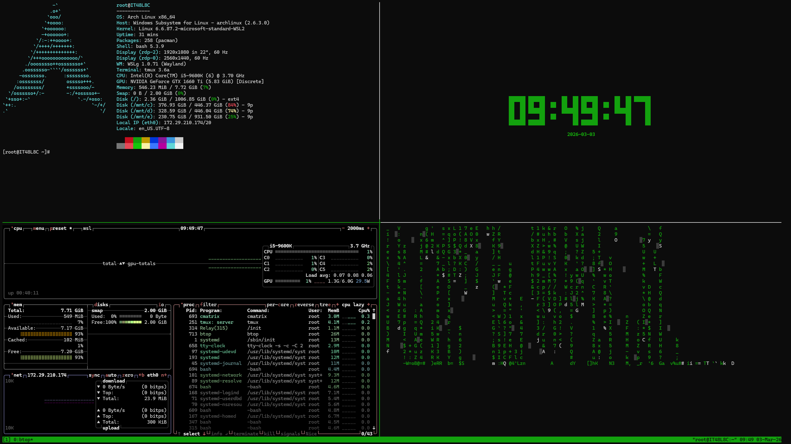

# Arch Linux WSL Setup

A quick setup guide for installing Arch Linux on WSL (Windows Subsystem for Linux) with terminal tools like fastfetch, cmatrix, btop, tty-clock, pipes.sh and more.



---

## Prerequisites

Make sure WSL is installed and enabled on your machine.

Open **PowerShell as Administrator** and verify WSL:

```powershell
wsl --version
```

Check available distributions:

```powershell
wsl --list --online
```

> 💡 Arch Linux should appear in the list as `archlinux`. If WSL is not installed, run: `wsl --install`

---

## Installation

### 1. Install Arch Linux

```powershell
wsl --install archlinux
```

Installation takes a few minutes. Once complete, Arch Linux launches automatically.

> 💡 Arch opens as root by default — this is normal. A user account is created in the next step.

---

### 2. Update the System

```bash
pacman -Syu
```

Confirm with `Y` when prompted.

---

### 3. Create a User

```bash
useradd -m -G wheel yourusername
passwd yourusername
```

Add the user to sudoers:

```bash
echo "yourusername ALL=(ALL) ALL" >> /etc/sudoers
```

Replace `yourusername` with your own username.

---

### 4. Install Go (required for AUR helper)

```bash
pacman -S git base-devel go
```

---

### 5. Install yay (AUR helper)

Switch to your user first:

```bash
su - yourusername
git clone https://aur.archlinux.org/yay.git
cd yay
makepkg -si
```

---

### 6. Install Terminal Tools

```bash
pacman -S fastfetch cmatrix btop tmux nano
yay -S pipes.sh cbonsai tty-clock peaclock
```

---

### 7. Fix Locale (required for some tools)

```bash
echo "en_US.UTF-8 UTF-8" >> /etc/locale.gen
locale-gen
echo "LANG=en_US.UTF-8" > /etc/locale.conf
export LANG=en_US.UTF-8
```

---

### 8. Autostart fastfetch

```bash
echo "fastfetch" >> ~/.bashrc
echo "source ~/.bashrc" >> ~/.bash_profile
```

Restart the terminal — fastfetch will now appear automatically on startup.

> 💡 If you accidentally added fastfetch twice, remove the duplicate with:
> ```bash
> sed -i '0,/fastfetch/!{/fastfetch/d}' ~/.bashrc
> ```

---

## tmux Layout

Use tmux to run multiple tools in a single terminal window without borders.

Start tmux:

```bash
tmux
```

### Keybinds

| Keybind | Action |
|---|---|
| `Ctrl+B` then `%` | Split vertically |
| `Ctrl+B` then `"` | Split horizontally |
| `Ctrl+B` then arrow key | Switch pane |
| `Ctrl+B` then `z` | Zoom in/out a pane |
| `Ctrl+B` then `x` | Close pane |
| `Ctrl+B` then `d` | Detach session |

### Split into 4 panes

```
Ctrl+B %          → split vertically (2 panes)
Ctrl+B →          → move to right pane
Ctrl+B "          → split horizontally
Ctrl+B ←          → move to left pane
Ctrl+B "          → split horizontally
```

Then run a tool in each pane:

| Pane | Command |
|---|---|
| Top left | `fastfetch` |
| Top right | `tty-clock -s -c -C 2` |
| Bottom left | `btop` |
| Bottom right | `cmatrix` |

---

## Automated Setup

Clone the repo and run the setup script:

```bash
chmod +x setup.sh
./setup.sh
```

Or run directly:

```bash
curl -s https://raw.githubusercontent.com/yourusername/wsl-setup/main/setup.sh | bash
```

---

## Opening Arch Linux WSL

- Search for **Arch Linux** in the Start menu
- Or run in PowerShell:
  ```powershell
  wsl -d archlinux
  ```
- Add it as a profile in **Windows Terminal** for quick access

---

## Uninstall

```powershell
wsl --unregister archlinux
```

> ⚠️ **Warning:** This removes the entire filesystem and all files within Arch. Windows files are not affected.

---

## Quick Reference

| Command | Description |
|---|---|
| `pacman -Syu` | Update all packages |
| `pacman -S packagename` | Install a package |
| `pacman -R packagename` | Remove a package |
| `yay -S packagename` | Install AUR package |
| `fastfetch` | Display system info |
| `cmatrix` | Matrix animation (exit: `Ctrl+C`) |
| `btop` | Resource monitor |
| `tty-clock -s -c -C 2` | Terminal clock |
| `pipes.sh` | Animated pipes |
| `cbonsai -S` | Animated bonsai tree |
| `tmux` | Terminal multiplexer |
| `wsl --list --verbose` | List installed WSL distributions |
| `wsl --unregister archlinux` | Uninstall Arch WSL |
